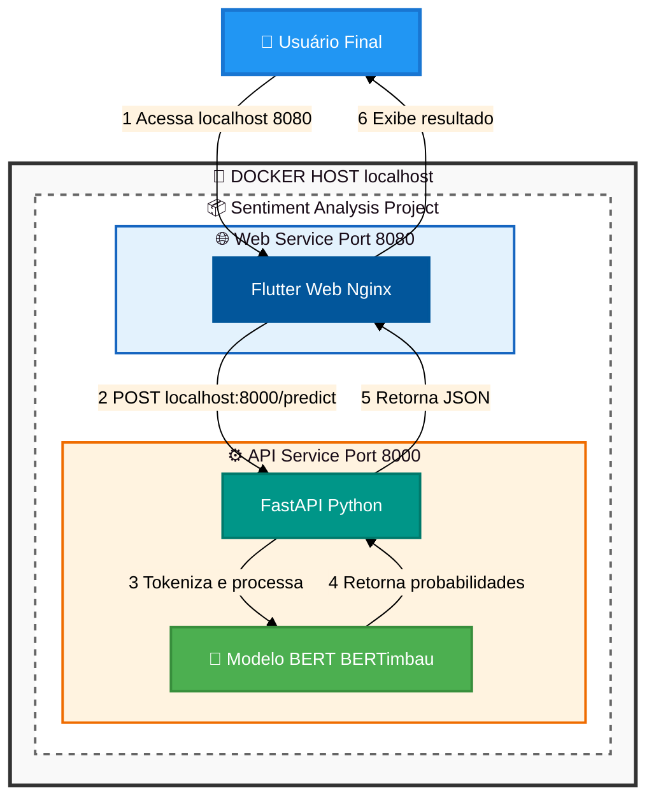

# 🎯 Análise de Sentimentos em Comentários de Aplicativos Comerciais

> Plataforma completa para análise automática de sentimentos em avaliações e comentários utilizando Deep Learning e arquitetura de microsserviços.

[](https://www.python.org/)
[](https://flutter.dev/)
[](https://fastapi.tiangolo.com/)
[](https://www.docker.com/)
[](https://creativecommons.org/licenses/by-nc-sa/4.0/)

---

## 👥 Autoria

**Autor:** Lucas Evandro Theisen  
**Orientador:** Prof. Dr. Anderson Brilhador  
**Coorientador:** Prof. Dr. Giuvane Conti

**Instituição:** Universidade Tecnológica Federal do Paraná - Campus Santa Helena  
**Curso:** Bacharelado em Ciência da Computação  
**Ano:** 2025

### Banca Examinadora

- Prof. Dr. Anderson Brilhador (Orientador) - UTFPR
- Profa. Dra. Giani Carla Ito - UTFPR
- Profa. Dra. Leliane Rezende - UTFPR

**Data de Aprovação:** 1 de dezembro de 2025

---

## 📄 Licença

<div align="center">


**Creative Commons Atribuição-NãoComercial-CompartilhaIgual 4.0 Internacional**

</div>

© 2025 Lucas Evandro Theisen

Esta licença permite que reutilizadores distribuam, remixem, adaptem e criem a partir do material em qualquer meio ou formato apenas para fins não comerciais. Se outros modificarem ou adaptarem o material, eles devem licenciar o material modificado sob termos idênticos.

### 📋 Termos da Licença

**BY:** O crédito deve ser dado a você, o criador.

**NC:** Apenas o uso não comercial do seu trabalho é permitido. *Não comercial significa não primariamente direcionado para ou dirigido para vantagem comercial ou compensação monetária.*

**SA:** Adaptações devem ser compartilhadas sob os mesmos termos.

---

Veja o arquivo [LICENSE](LICENSE) para o texto legal completo da licença.

---

## 📋 Sumário

**Navegação Rápida:**

🎓 [Visão Geral](#-visão-geral) •
🏗️ [Arquitetura do Sistema](#%EF%B8%8F-arquitetura-do-sistema) •
🛠️ [Tecnologias Utilizadas](#%EF%B8%8F-tecnologias-utilizadas) •
🚀 [Quick Start](#-quick-start) •
📁 [Estrutura do Projeto](#-estrutura-do-projeto) •
🧩 [Componentes do Sistema](#-componentes-do-sistema) •
📚 [Documentação Detalhada](#-documentação-detalhada) •
💻 [Desenvolvimento](#-desenvolvimento) •
📄 [Citação Acadêmica](#-citação-acadêmica)

---

## 🎓 Visão Geral

Este é um **Trabalho de Conclusão de Curso (TCC)** intitulado "Análise de Sentimentos em Comentários de Aplicativos Comerciais" que apresenta uma solução completa para análise de sentimentos em textos em português. O sistema utiliza um modelo de **Deep Learning baseado em BERT** (BERTimbau) para classificar avaliações em 5 níveis de sentimento, desde extremamente negativo até extremamente positivo.

### 🎯 Objetivos do Projeto

- Desenvolver um modelo de classificação de sentimentos preciso para português brasileiro
- Criar uma API escalável e performática para servir o modelo
- Implementar uma interface web intuitiva e responsiva
- Aplicar boas práticas de engenharia de software e DevOps
- Demonstrar viabilidade de deploy em produção com containers

### ✨ Funcionalidades Principais

- 🤖 **Classificação Inteligente**: Modelo baseado em BERTimbau com 5 níveis de sentimento
- 📊 **Análise Detalhada**: Visualização de probabilidades para cada classe
- ⚡ **Análise em Tempo Real**: Debouncing de 700ms para experiência fluida
- 💾 **Histórico Local**: Armazenamento de avaliações analisadas
- 🎨 **Interface Intuitiva**: Representação visual com estrelas e emojis
- 🐳 **Deploy Simplificado**: Arquitetura containerizada com Docker

### 📈 Resultados Esperados

- Precisão superior a 85% na classificação de sentimentos
- Tempo de resposta inferior a 500ms por requisição
- Interface responsiva funcionando em múltiplos dispositivos
- Sistema escalável e pronto para produção

---

## 🏗️ Arquitetura do Sistema

O sistema segue uma arquitetura de **microsserviços** com três componentes principais:



### 🔄 Fluxo de Dados

1. **Usuário** digita uma avaliação na interface web
2. **Frontend** (Flutter) envia requisição HTTP para a API após debouncing
3. **API** (FastAPI) recebe o texto e tokeniza usando BERTimbau tokenizer
4. **Modelo BERT** processa os tokens e gera embeddings contextualizados
5. **Classificador** (camada Dense) produz probabilidades para cada classe
6. **API** retorna JSON com classe prevista, sentimento e probabilidades
7. **Frontend** exibe resultados com visualização gráfica (estrelas + emoji)

---

## 🛠️ Tecnologias Utilizadas

### Backend (API)

| Tecnologia | Versão | Propósito |
|-----------|--------|-----------|
| **Python** | 3.11 | Linguagem base |
| **FastAPI** | 0.95+ | Framework web assíncrono de alta performance |
| **PyTorch** | 2.1.2 (CPU) | Framework de Deep Learning otimizado |
| **Transformers** | 4.36.2 | Biblioteca Hugging Face para modelos BERT |
| **Uvicorn** | Latest | Servidor ASGI de alta performance |
| **Pydantic** | Latest | Validação de dados e serialização |

**Modelo de ML:**

- **BERTimbau Base** (`neuralmind/bert-base-portuguese-cased`): Modelo BERT pré-treinado em português brasileiro
- **Arquitetura**: BERT (768) + Dropout (0.3) + Linear (768 → 5 classes)
- **Otimizador**: AdamW (lr=3e-5, weight_decay=0.01)
- **Épocas**: 10 com early stopping
- **Batch Size**: 16
- **Comprimento máximo**: 281 tokens
- **Dataset**: 3000 avaliações balanceadas (5 classes)

### Frontend (Web App)

| Tecnologia | Versão | Propósito |
|-----------|--------|-----------|
| **Flutter** | 3.0+ | Framework UI multiplataforma do Google |
| **Dart** | 2.19+ | Linguagem de programação otimizada |
| **MobX** | 2.0+ | Gerenciamento de estado reativo e observável |
| **HTTP/Dio** | Latest | Cliente HTTP para comunicação com API |
| **Google Fonts** | Latest | Tipografia moderna |
| **Animated Emoji** | Latest | Feedback visual animado |

### Machine Learning & Data Science

| Tecnologia | Versão | Propósito |
|-----------|--------|-----------|
| **pandas** | 2.1.4 | Manipulação e análise de dados |
| **numpy** | 1.26.4 | Computação numérica de alta performance |
| **scikit-learn** | 1.3.2 | Algoritmos de ML e métricas de avaliação |
| **matplotlib** | 3.8.2 | Visualização de dados (gráficos estáticos) |
| **seaborn** | 0.13.0 | Visualização estatística avançada |
| **LeIA-br** | 0.0.1 | Análise de sentimentos em português |
| **emoji** | 2.10.0 | Processamento de emojis em textos |

### DevOps & Infrastructure

- **Docker** & **Docker Compose**: Containerização e orquestração de serviços
- **Nginx**: Servidor web para servir aplicação Flutter
- **Git & GitHub**: Controle de versão e colaboração

---

## 🚀 Quick Start

### Pré-requisitos

Certifique-se de ter instalado:

- [Docker](https://www.docker.com/get-started) (v20.10+)
- [Docker Compose](https://docs.docker.com/compose/install/) (v2.0+)
- Portas **8000** e **8080** disponíveis

### Executar o Sistema Completo

#### Opção 1: Usando Docker Compose (Recomendado)

```bash
# Clone o repositório
git clone https://github.com/LucasTheisen31/sentiment_analysis_project.git
cd sentiment_analysis_project

# Inicie todos os serviços
docker-compose up --build

# Para executar em background (detached mode)
docker-compose up -d --build
```

#### Opção 2: Desenvolvimento Local

**Backend (API):**

```bash
cd api
python -m venv .venv
source .venv/bin/activate  # Windows: .venv\Scripts\activate
pip install -r requirements.txt
python -m sentiment_analyzer.api
```

**Frontend (Flutter Web):**

```bash
cd sentiment_analysis_app
flutter pub get
flutter run -d chrome
```

**Notebooks de Desenvolvimento:**

```bash
cd notebooks_and_scripts
python -m venv .venv
source .venv/bin/activate  # Windows: .venv\Scripts\activate
pip install -r requirements.txt
jupyter notebook
```

### 🌐 Acessar o Sistema

Após os containers iniciarem com sucesso:

- **🖥️ Aplicação Web**: [http://localhost:8080](http://localhost:8080)
- **📡 API Backend**: [http://localhost:8000](http://localhost:8000)
- **📚 Documentação da API** (Swagger): [http://localhost:8000/docs](http://localhost:8000/docs)
- **📋 Documentação da API** (ReDoc): [http://localhost:8000/redoc](http://localhost:8000/redoc)

### 🧪 Testar a API Manualmente

```bash
# Usando curl
curl -X POST "http://localhost:8000/predict" \
  -H "Content-Type: application/json" \
  -d '{"text": "Este produto é excelente! Recomendo muito!"}'

# Usando PowerShell
$body = @{ text = "Este produto é excelente! Recomendo muito!" } | ConvertTo-Json
Invoke-RestMethod -Uri "http://localhost:8000/predict" -Method POST -Body $body -ContentType "application/json"
```

**Resposta esperada:**

```json
{
  "predicted_class": 4,
  "predicted_sentiment": "extremamente positivo",
  "confidence": 0.9823,
  "probabilities": [
    {
      "sentiment": "extremamente negativo",
      "probability": 0.0012,
      "sentiment_class": 0
    },
    {
      "sentiment": "negativo",
      "probability": 0.0034,
      "sentiment_class": 1
    },
    {
      "sentiment": "neutro",
      "probability": 0.0098,
      "sentiment_class": 2
    },
    {
      "sentiment": "positivo",
      "probability": 0.0033,
      "sentiment_class": 3
    },
    {
      "sentiment": "extremamente positivo",
      "probability": 0.9823,
      "sentiment_class": 4
    }
  ]
}
```

### 🛑 Parar o Sistema

```bash
# Parar containers (preserva volumes)
docker-compose down

# Parar e remover volumes
docker-compose down -v

# Parar e remover imagens também
docker-compose down --rmi all
```

---

## 📁 Estrutura do Projeto

```
sentiment_analysis_project/
├── 📄 README.md                          # Este arquivo
├── 📄 .gitignore                         # Arquivos ignorados pelo Git
│
├── 📂 sentiment_analysis_project/        # Diretório principal do sistema
│   ├── 📄 docker-compose.yml             # Orquestração dos containers
│   ├── 📄 README.md                      # Documentação técnica detalhada
│   │
│   ├── 📂 api/                           # Backend Python/FastAPI
│   │   ├── 📄 Dockerfile                 # Imagem Docker da API
│   │   ├── 📄 requirements.txt           # Dependências Python
│   │   ├── 📄 config.json                # Configurações do modelo
│   │   ├── 📂 assets/                    # Modelo treinado (.bin)
│   │   ├── 📂 bin/                       # Scripts auxiliares
│   │   └── 📂 sentiment_analyzer/        # Código fonte da API
│   │       ├── 📄 api.py                 # Endpoints FastAPI
│   │       ├── 📂 classifier/            # Modelo e classificador
│   │       │   ├── 📄 model.py           # Carregamento e inferência
│   │       │   └── 📄 sentiment_classifier.py  # Arquitetura BERT
│   │       └── 📂 models/                # Schemas Pydantic
│   │           ├── 📄 prediction_request_model.py
│   │           ├── 📄 prediction_response_model.py
│   │           └── 📄 class_probability_model.py
│   │
│   └── 📂 web/                           # Frontend Flutter Web
│       ├── 📄 Dockerfile                 # Imagem Docker do frontend
│       ├── 📄 nginx/default.conf         # Configuração Nginx
│       └── 📂 ...                        # Build do Flutter
│
└── 📂 sentiment_analysis_app/            # Código fonte Flutter
    ├── 📄 README.md                      # Documentação do app Flutter
    ├── 📄 pubspec.yaml                   # Dependências Dart
    └── 📂 lib/                           # Código Dart
        ├── 📄 main.dart                  # Entry point
        ├── 📂 core/                      # Recursos compartilhados
        ├── 📂 models/                    # Modelos de dados
        ├── 📂 repositories/              # Camada de dados (API)
        └── 📂 screens/                   # Telas (MVC + MobX)
            └── 📂 home/
                ├── 📄 home_screen.dart           # View
                ├── 📄 home_controller.dart       # Controller (MobX)
                └── 📂 components/                # Widgets
```

---

## 🧩 Componentes do Sistema

### 1. 🐍 API Service (Backend)

**Localização**: `sentiment_analysis_project/api/`

Backend desenvolvido em **Python** com **FastAPI**, responsável por:

- Servir o modelo de classificação de sentimentos
- Processar requisições POST em `/predict`
- Tokenizar textos usando BERTimbau tokenizer
- Realizar inferência com PyTorch
- Retornar predições com probabilidades

**Principais características:**

- ✅ Validação automática com Pydantic
- ✅ Documentação automática (Swagger/ReDoc)
- ✅ CORS habilitado para requisições cross-origin
- ✅ Singleton pattern para carregamento único do modelo
- ✅ Suporte a GPU e CPU (detecção automática)

➡️ **Documentação completa**: [api/README.md](sentiment_analysis_project/api/README.md)

### 2. 🎨 Web Service (Frontend)

**Localização**: `sentiment_analysis_project/web/` (build) e `sentiment_analysis_app/` (código fonte)

Frontend desenvolvido em **Flutter Web**, responsável por:

- Interface interativa para entrada de avaliações
- Comunicação com a API via HTTP (Dio)
- Visualização de resultados com estrelas e emojis
- Gerenciamento de histórico local
- Debouncing de requisições (700ms)

**Arquitetura:**

- 🏗️ Padrão MVC
- 📦 Gerenciamento de estado: MobX
- 🔄 Observables reativos
- 🎯 Injeção de dependências

➡️ **Documentação completa**: [sentiment_analysis_app/README.md](sentiment_analysis_app/README.md)

### 3. 🐳 Docker Compose

**Localização**: `sentiment_analysis_project/docker-compose.yml`

Orquestra os serviços com as seguintes configurações:

```yaml
services:
  api_service:
    build: ./api/.
    container_name: container_sentiment_analysis_api
    ports:
      - "8000:8000"

  web_service:
    build: ./web/.
    container_name: container_sentiment_analysis_web
    ports:
      - "8080:80"
    depends_on:
      - api_service
```

**Características:**

- ✅ Builds isolados e reproduzíveis
- ✅ Rede interna para comunicação entre serviços
- ✅ Healthchecks para garantir disponibilidade
- ✅ Restart automático em caso de falha

---

## 💻 Desenvolvimento

### Executar Componentes Individualmente

#### Backend (API)

```bash
cd sentiment_analysis_project/api

# Criar ambiente virtual
python -m venv venv
source venv/bin/activate  # Linux/Mac
# ou
.\venv\Scripts\activate   # Windows

# Instalar dependências
pip install -r requirements.txt

# Iniciar servidor
uvicorn sentiment_analyzer.api:app --reload --host 0.0.0.0 --port 8000
```

#### Frontend (Flutter)

```bash
cd sentiment_analysis_app

# Instalar dependências
flutter pub get

# Gerar código MobX
flutter pub run build_runner build --delete-conflicting-outputs

# Executar em modo web
flutter run -d chrome

# Build para produção
flutter build web --release
```

### Comandos Úteis

```bash
# Ver logs dos containers
docker-compose logs -f

# Ver logs de um serviço específico
docker-compose logs -f api_service

# Rebuild de um serviço específico
docker-compose up -d --build api_service

# Executar comando dentro de um container
docker-compose exec api_service bash

# Ver status dos serviços
docker-compose ps

# Limpar recursos do Docker
docker system prune -a
```

## 📚 Documentação Adicional

### Documentos do Projeto

| Documento | Descrição |
|-----------|-----------|
| [README.txt](README.txt) | Instruções de uso do sistema completo |
| [README.md](README.md) | Visão geral do projeto (este arquivo) |
| [notebooks_and_scripts/README.md](notebooks_and_scripts/README.md) | Pipeline de dados e treinamento |
| [sentiment_analysis_project/README.md](sentiment_analysis_project/README.md) | Documentação técnica do sistema (deploy com Docker Compose - API e frontend Flutter web) |
| [sentiment_analysis_project/api/README.md](sentiment_analysis_project/api/README.md) | Documentação técnica da API |
| [sentiment_analysis_project/web/README.md](sentiment_analysis_project/web/README.md) | Documentação do frontend Flutter web |
| [sentiment_analysis_app/README.md](sentiment_analysis_app/README.md) | Documentação da aplicação front-end Flutter |
| [LICENSE](LICENSE) | Licença do projeto |

---

## 📄 Citação Acadêmica

Se você utilizar este trabalho em sua pesquisa, por favor cite:

```bibtex
@mastersthesis{theisen2025sentiment,
  title={Análise de Sentimentos em Comentários de Aplicativos Comerciais},
  author={Theisen, Lucas Evandro},
  year={2025},
  school={Universidade Tecnológica Federal do Paraná},
  type={Trabalho de Conclusão de Curso},
  address={Santa Helena, PR, Brasil}
}
```
