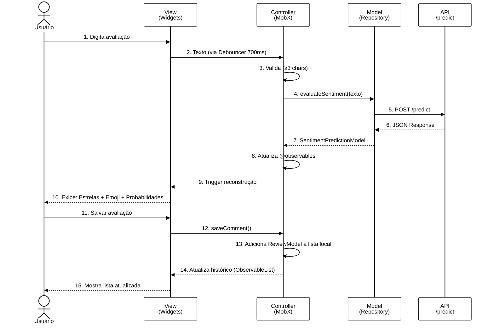

# Comment Analysis App - Flutter Web

## 👥 Autoria

**Autor:** Lucas Evandro Theisen  
**Orientador:** Prof. Dr. Anderson Brilhador  
**Coorientador:** Prof. Dr. Giuvane Conti

**Instituição:** Universidade Tecnológica Federal do Paraná - Campus Santa Helena  
**Curso:** Bacharelado em Ciência da Computação  
**Ano:** 2025

### Banca Examinadora

- Prof. Dr. Anderson Brilhador (Orientador) - UTFPR
- Profa. Dra. Giani Carla Ito - UTFPR
- Profa. Dra. Leliane Rezende - UTFPR

**Data de Aprovação:** 1 de dezembro de 2025

---

## 📄 Licença

<div align="center">


**Creative Commons Atribuição-NãoComercial-CompartilhaIgual 4.0 Internacional**

</div>

© 2025 Lucas Evandro Theisen

Esta licença permite que reutilizadores distribuam, remixem, adaptem e criem a partir do material em qualquer meio ou formato apenas para fins não comerciais. Se outros modificarem ou adaptarem o material, eles devem licenciar o material modificado sob termos idênticos.

### 📋 Termos da Licença

**BY:** O crédito deve ser dado a você, o criador.

**NC:** Apenas o uso não comercial do seu trabalho é permitido. *Não comercial significa não primariamente direcionado para ou dirigido para vantagem comercial ou compensação monetária.*

**SA:** Adaptações devem ser compartilhadas sob os mesmos termos.

---

Veja o arquivo [LICENSE](../LICENSE) para o texto legal completo da licença.

---

<!-- Forçar fundo branco nos diagramas Mermaid em diferentes renderizadores -->
<style>
.mermaid, .mermaid svg { background-color: #ffffff !important; }
</style>

---

## 📋 Visão Geral

Esta aplicação permite que usuários escrevam avaliações e obtenham análises de sentimento em tempo real, utilizando um modelo de IA baseado em BERT hospedado em uma API backend. A arquitetura segue o padrão MVC com gerenciamento de estado reativo usando MobX.

### ✨ Funcionalidades

- ✍️ **Análise em Tempo Real**: Digitação de avaliações com análise automática (debouncing de 700ms)
- 🎯 **Classificação Precisa**: 5 níveis de sentimento (extremamente negativo → extremamente positivo)
- 📊 **Visualização Detalhada**: Probabilidades para cada classe de sentimento
- ⭐ **Feedback Visual**: Representação com estrelas e emojis animados
- 💾 **Histórico Local**: Armazenamento de avaliações analisadas
- 🔄 **Interface Reativa**: Atualizações instantâneas usando MobX
- 📱 **Responsivo**: Funciona em diferentes tamanhos de tela

### 🎯 Modelo de Deep Learning

- **Modelo**: BERTimbau Base (neuralmind/bert-base-portuguese-cased)
- **Arquitetura**: BERT (768) + Dropout (0.3) + Linear (768 → 5 classes)
- **Dataset**: 3000 avaliações balanceadas
- **Acurácia**: >85% no conjunto de teste
- **Classes**: 5 níveis de sentimento

---

## Arquitetura MVC com MobX

### Fluxo de Interação Completo



### Camadas da Aplicação

```
lib/
├── main.dart                          # Entry point
├── core/                              # Recursos compartilhados
│   ├── env/                           # Variáveis de ambiente
│   ├── extensions/                    # Extension methods
│   ├── global/                        # Constantes e utilitários globais
│   └── ui/                            # Componentes UI reutilizáveis
├── models/                            # Modelos de dados
│   ├── review_model.dart              # Modelo de avaliação
│   ├── sentiment_prediction_model.dart # Resposta da API
│   └── sentiment_probability_model.dart # Probabilidades por classe
├── repositories/                       # Camada de dados
│   ├── sentiment_repository.dart       # Interface (abstração)
│   └── sentiment_repository_impl.dart  # Implementação (HTTP)
└── screens/                           # Telas da aplicação
    └── home/                          # Tela principal
        ├── home_screen.dart           # View
        ├── home_controller.dart       # Controller (MobX)
        └── components/                # Widgets específicos
```

---

## Detalhamento das Camadas

### 1. View (Widgets)

**Responsabilidade:** Interface do usuário e observação de mudanças de estado.

- `home_screen.dart`: Tela principal com campo de texto e visualização de resultados
- Componentes específicos para exibição de probabilidades e histórico
- Usa `Observer` do MobX para reagir a mudanças no Controller

**Exemplo:**

```dart
Observer(
  builder: (_) => Text(controller.predictedSentiment)
)
```

### 2. Controller (MobX Store)

**Responsabilidade:** Gerenciamento de estado observável e lógica de negócio.

**Principais recursos:**

- `@observable`: Campos que notificam mudanças (ex: `predictedSentiment`, `isLoading`)
- `@action`: Métodos que modificam o estado (ex: `evaluateSentiment()`, `saveComment()`)
- `@computed`: Valores derivados calculados automaticamente
- **Debouncer**: Atraso de 700ms para evitar chamadas excessivas à API

**Fluxo típico:**

1. View dispara ação no Controller
2. Controller valida dados
3. Controller chama Repository
4. Controller atualiza observables
5. View reage automaticamente

### 3. Model (Repository Pattern)

**Responsabilidade:** Comunicação com API e serialização de dados.

**Interface (`sentiment_repository.dart`):**

```dart
abstract class SentimentRepository {
  Future<SentimentPredictionModel> evaluateSentiment(String text);
}
```

**Implementação (`sentiment_repository_impl.dart`):**

- Faz requisições HTTP POST para `/predict`
- Deserializa JSON em modelos Dart
- Trata erros e exceções

### 4. Models (Entidades de Dados)

**`SentimentPredictionModel`**: Resposta completa da API

```dart
{
  predictedClass: int,           // 0-4
  predictedSentiment: String,    // "extremamente positivo"
  confidence: double,            // 0.0-1.0
  probabilities: List<SentimentProbabilityModel>
}
```

**`SentimentProbabilityModel`**: Probabilidade individual

```dart
{
  sentiment: String,
  sentimentClass: int,
  probability: double
}
```

**`ReviewModel`**: Avaliação salva localmente

```dart
{
  text: String,
  sentiment: String,
  rating: double,
  timestamp: DateTime
}
```

---

---

## 🛠️ Tecnologias e Dependências

### Principais Packages

| Package | Versão | Propósito |
|---------|--------|-----------|
| **mobx** + **flutter_mobx** | 2.0+ | Gerenciamento de estado reativo e observável |
| **http** / **dio** | Latest | Cliente HTTP para comunicação com API backend |
| **build_runner** | Latest | Geração automática de código para MobX |
| **flutter_rating_bar** | Latest | Widget de estrelas para avaliação visual |
| **google_fonts** | Latest | Tipografia moderna (Roboto) |
| **animated_emoji** | Latest | Emojis animados para feedback visual |
| **flutter_dotenv** | Latest | Gerenciamento de variáveis de ambiente |

---

## 🚀 Como Executar

### Pré-requisitos

- **Flutter SDK 3.0+** ([Download](https://docs.flutter.dev/get-started/install))
- **Dart SDK 3.0+** (incluído com Flutter)
- **API Backend** rodando em `http://localhost:8000`
- **Chrome** ou navegador compatível

### Passos para Executar

1. **Criar arquivo `.env` (ou copie `.env.example`):**

```bash
echo "API_URL = http://localhost:8000" > .env
```

2. **Instalar dependências:**

```bash
flutter pub get
```

3. **Gerar código MobX:**

```bash
# Build único
dart run build_runner build --delete-conflicting-outputs

# Modo watch (recomendado para desenvolvimento)
dart run build_runner watch --delete-conflicting-outputs
```

4. **Executar em modo web:**

```bash
flutter run -d chrome

# Com porta customizada
flutter run -d chrome --web-port=3000
```

5. **Build para produção:**

```bash
flutter build web
```

**⚠️ Importante:**

- O arquivo `.env` já está no `.gitignore` e não será versionado
- Use `.env.example` como referência para as variáveis necessárias
- As variáveis são carregadas automaticamente no `main.dart` antes do app iniciar

---

## Fluxo de Dados Detalhado

### 1. Análise de Sentimento em Tempo Real

```
Usuário digita → Debouncer (700ms) → Validação (≥3 chars) 
→ Repository.evaluateSentiment() → HTTP POST /predict 
→ Resposta JSON → Modelo Dart → Controller atualiza observables 
→ View reconstrói automaticamente
```

### 2. Salvamento de Avaliação

```
Usuário clica "Salvar" → Controller.saveComment() 
→ Cria ReviewModel → Adiciona a ObservableList 
→ View atualiza histórico automaticamente
```

---

## Padrões e Boas Práticas

### Reatividade MobX

- **Observables**: Use `@observable` para campos que devem notificar mudanças
- **Actions**: Sempre modifique observables dentro de `@action`
- **Computed**: Use `@computed` para valores derivados (evita cálculos redundantes)
- **Reactions**: Use `reaction()` ou `autorun()` para efeitos colaterais

### Debouncing

Implementado para evitar sobrecarga da API durante digitação rápida:

```dart
Timer? _debouncer;

void onTextChanged(String text) {
  _debouncer?.cancel();
  _debouncer = Timer(Duration(milliseconds: 700), () {
    evaluateSentiment(text);
  });
}
```

### Repository Pattern

- **Abstração**: Interface define contrato
- **Implementação**: Classe concreta lida com detalhes HTTP
- **Testabilidade**: Facilita mocks e testes unitários

---

## Observações Técnicas

- **Performance**: Debouncing reduz requisições desnecessárias em ~90%
- **UX**: Feedback visual com loading states e animações
- **Validação**: Mínimo de 3 caracteres evita análises de texto muito curto
- **Reatividade**: MobX elimina `setState()` manual e simplifica sincronização
- **Escalabilidade**: Arquitetura MVC permite adicionar novas features facilmente

---

## 📚 Documentação Adicional

### Documentos do Projeto

| Documento | Descrição |
|-----------|-----------|
| [README.txt](../README.txt) | Instruções de uso do sistema completo |
| [README.md](../README.md) | Visão geral do projeto |
| [api/README.md](../sentiment_analysis_project/api/README.md) | Documentação técnica da API |
| [api/TRAINING.md](../sentiment_analysis_project/api/TRAINING.md) | Explicação visual dos conceitos de treinamento |
| [LICENSE](../LICENSE) | Licença do projeto |

---

## 📄 Citação Acadêmica

Se você utilizar este trabalho em sua pesquisa, por favor cite:

```bibtex
@mastersthesis{theisen2025sentiment,
  title={Análise de Sentimentos em Comentários de Aplicativos Comerciais},
  author={Theisen, Lucas Evandro},
  year={2025},
  school={Universidade Tecnológica Federal do Paraná},
  type={Trabalho de Conclusão de Curso},
  address={Santa Helena, PR, Brasil}
}
```

**Nota:** Esta documentação faz parte do TCC "ANÁLISE DE SENTIMENTOS EM COMENTÁRIOS DE APLICATIVOS COMERCIAIS", desenvolvido na UTFPR - Campus Santa Helena em 2025.
