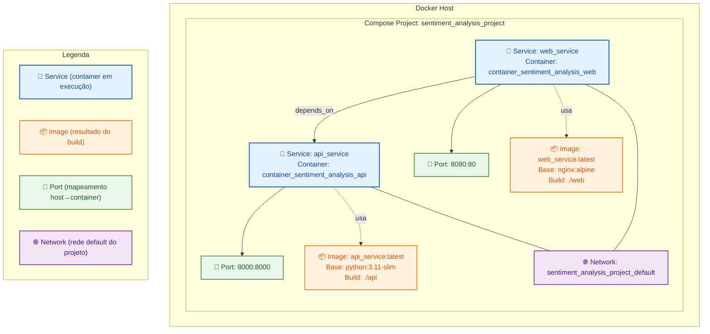
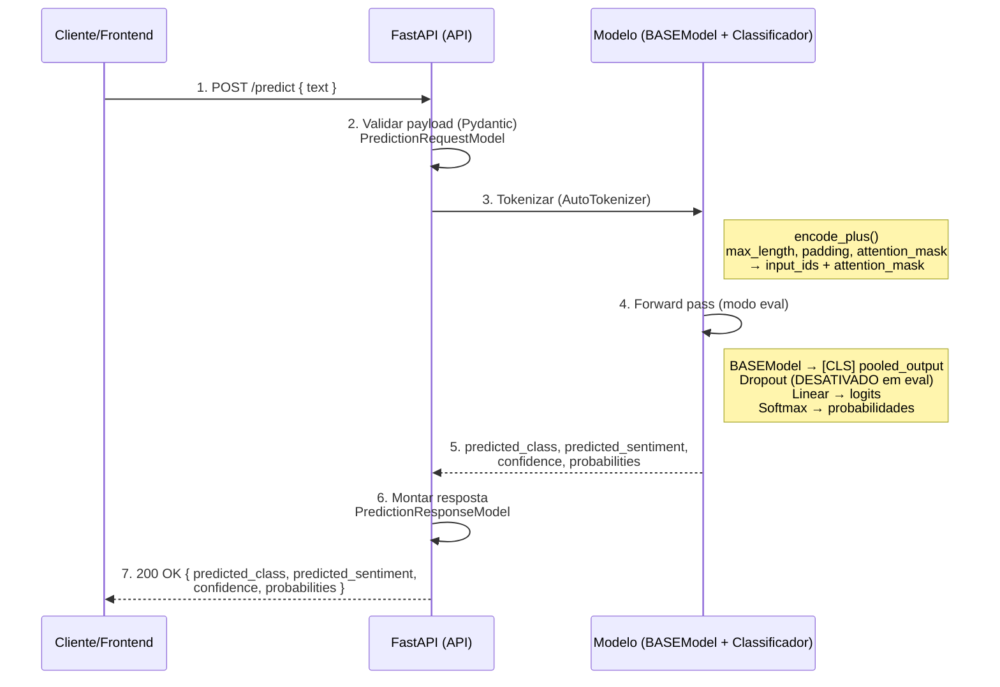
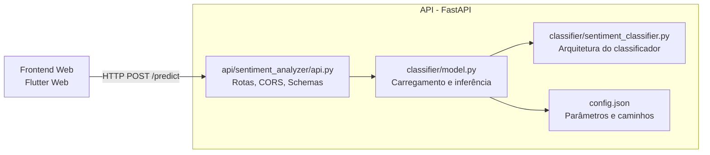
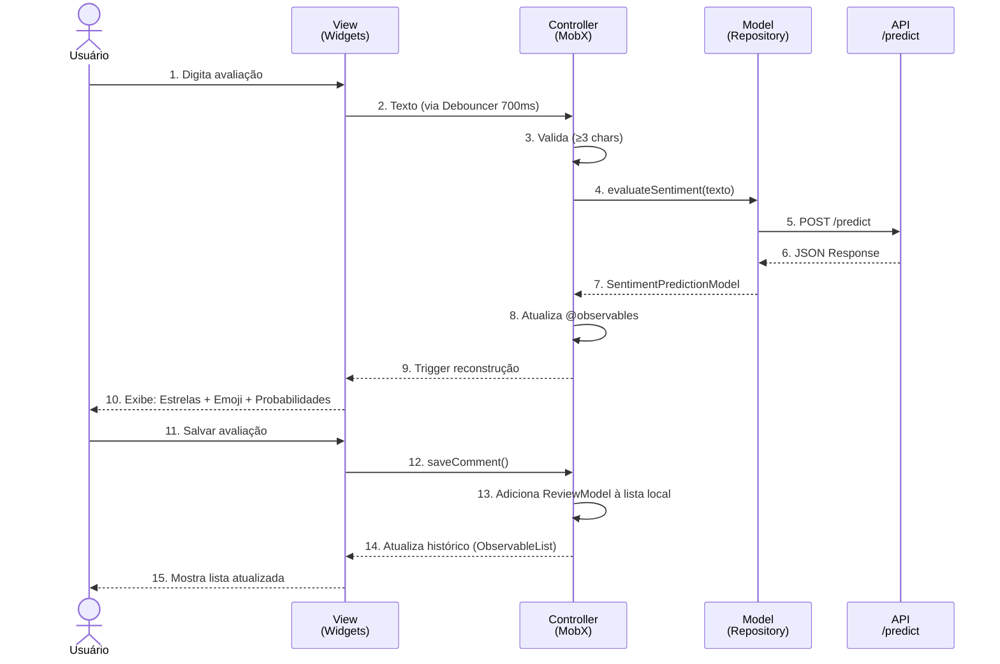

# Sistema de Análise de Sentimentos

Sistema completo de análise de sentimentos com backend Python/FastAPI e frontend Flutter Web, containerizado com Docker.

<!-- Forçar fundo branco nos diagramas Mermaid em diferentes renderizadores -->
<style>
.mermaid, .mermaid svg { background-color: #ffffff !important; }
</style>

## 📋 Visão Geral

Este projeto fornece uma solução end-to-end para análise de sentimentos de textos em português, utilizando um modelo de deep learning baseado em transformers (BERTimbau).

### ✨ Funcionalidades Principais

- 🤖 **Modelo de IA**: Classificação em 5 níveis de sentimento
- 🚀 **API REST**: Endpoint `/predict` com FastAPI
- 💻 **Interface Web**: Aplicação Flutter responsiva
- 🐳 **Containerização**: Deploy simplificado com Docker Compose
- 📊 **Probabilidades**: Visualização detalhada de confiança por classe
- ⚡ **Performance**: Debouncing e otimizações de requisição

### 🏗️ Arquitetura do Sistema

O sistema é composto por dois serviços principais executando em containers Docker:

1. **API Service**: Backend Python/FastAPI com modelo de classificação de sentimentos
2. **Web Service**: Frontend Flutter Web servido via Nginx

---

## 🚀 Quick Start

### Pré-requisitos

- Docker e Docker Compose instalados
- Portas 8000 e 8080 disponíveis

### Executar o Sistema

```bash
# Clone o repositório
git clone <repository-url>
cd sentiment_analysis_project

# IMPORTANTE: Entre no diretório que contém o docker-compose.yml
cd sentiment_analysis_project

# Inicie os serviços
docker-compose up --build

# Acesse:
# - API: http://localhost:8000
# - Web App: http://localhost:8080
# - Docs API: http://localhost:8000/docs
```

**Ou execute de qualquer lugar especificando o caminho:**
```bash
docker-compose -f sentiment_analysis_project/docker-compose.yml up --build
```

### Docker Compose Configuration

```yaml
services:
    api_service:
        build: ./api/.
        container_name: container_sentiment_analysis_api
        ports:
            - "8000:8000"

    web_service:
        build: ./web/.
        container_name: container_sentiment_analysis_web
        ports:
            - "8080:80"
        depends_on:
            - api_service
```

---

## 🏛️ Arquitetura e Infraestrutura

### Diagrama de Infraestrutura Docker



---

## 🔧 Backend — API de Análise de Sentimentos

### Tecnologias

- **Python 3.11**: Linguagem base
- **FastAPI**: Framework web moderno e performático
- **PyTorch**: Framework de deep learning
- **Transformers (HuggingFace)**: Biblioteca para modelos de linguagem
- **Uvicorn**: Servidor ASGI de alta performance

### Estrutura do Projeto

```
api/
├── sentiment_analyzer/
│   ├── api.py                           # Rotas FastAPI e endpoints
│   ├── classifier/
│   │   ├── model.py                     # Carregamento e inferência
│   │   └── sentiment_classifier.py      # Arquitetura do classificador
│   └── models/                          # Pesos do modelo treinado
├── config.json                          # Configurações (paths, hiperparâmetros)
├── requirements.txt                     # Dependências Python
└── bin/
    └── start_server.sh                  # Script de inicialização
```

### Fluxo de Requisição → Inferência → Resposta



### Componentes da API



### Pipeline de Inferência

**1. Recebimento da Requisição**
- Endpoint: `POST /predict`
- Validação automática via Pydantic schemas

**2. Tokenização**
- AutoTokenizer do modelo BERTimbau
- Padding e attention masks automáticos
- Max length configurável

**3. Forward Pass**
- Modelo em modo `eval()` (dropout desativado)
- Extração do output `[CLS]`
- Camada linear para logits
- Softmax para probabilidades

**4. Resposta Estruturada**
- Classe predita (0-4)
- Label de sentimento (string)
- Confiança (0.0-1.0)
- Probabilidades individuais por classe

### Exemplo Prático

**Requisição:**

```http
POST http://localhost:8000/predict
Content-Type: application/json

{"text": "O serviço é excelente, recomendo muito!"}
```

**Resposta:**

```json
{
    "predicted_class": 4,
    "predicted_sentiment": "extremamente positivo",
    "confidence": 0.8725212812423706,
    "probabilities": [
        {
            "sentiment": "extremamente negativo",
            "sentiment_class": 0,
            "probability": 0.002837304025888443
        },
        {
            "sentiment": "negativo",
            "sentiment_class": 1,
            "probability": 0.010028536431491375
        },
        {
            "sentiment": "neutro",
            "sentiment_class": 2,
            "probability": 0.02037421241402626
        },
        {
            "sentiment": "positivo",
            "sentiment_class": 3,
            "probability": 0.09423869848251343
        },
        {
            "sentiment": "extremamente positivo",
            "sentiment_class": 4,
            "probability": 0.8725212812423706
        }
    ]
}
```

---

## 💻 Frontend — Aplicação Flutter Web

### Tecnologias

- **Flutter 3.0+**: Framework UI multiplataforma
- **Dart 3.0+**: Linguagem de programação
- **MobX**: Gerenciamento de estado reativo
- **flutter_dotenv**: Gerenciamento de variáveis de ambiente
- **HTTP**: Cliente HTTP para comunicação com API
- **flutter_rating_bar**: Widget de avaliação com estrelas
- **animated_emoji**: Emojis animados para feedback visual
- **Nginx**: Servidor web para produção

### Estrutura do Projeto

```
comment_analysis_app/
├── .env                                   # Variáveis de ambiente (não versionado)
├── lib/
│   ├── main.dart                          # Entry point (carrega .env)
│   ├── core/                              # Recursos compartilhados
│   │   ├── env/
│   │   │   └── env.dart                   # Singleton para flutter_dotenv
│   │   ├── extensions/                    # Extension methods
│   │   ├── global/
│   │   │   └── constants/
│   │   │       └── endpoints.dart         # URLs da API (usa Env)
│   │   └── ui/                            # Componentes reutilizáveis
├── models/                                # Modelos de dados
│   ├── review_model.dart                  # Avaliação local
│   ├── sentiment_prediction_model.dart    # Resposta API
│   └── sentiment_probability_model.dart   # Probabilidades
├── repositories/                          # Camada de dados
│   ├── sentiment_repository.dart          # Interface
│   └── sentiment_repository_impl.dart     # Implementação HTTP
└── screens/                               # Telas
    └── home/
        ├── home_screen.dart               # View
        ├── home_controller.dart           # Controller (MobX)
        └── components/                    # Widgets específicos
```

### Arquitetura MVC com MobX

O front-end utiliza uma arquitetura MVC com MobX para gerenciamento de estado reativo.



### Camadas da Aplicação

#### **View (Widgets)**
- Interface do usuário Flutter
- Observa mudanças no Controller via `Observer`
- Widgets reativos que se reconstroem automaticamente
- Componentes visuais: estrelas, emojis, gráficos de probabilidade

#### **Controller (MobX Store)**
- Gerencia estado observável (`@observable`)
- Define ações (`@action`) que modificam o estado
- Aplica debouncing de 700ms para otimizar requisições
- Validação de entrada (≥3 caracteres)

#### **Model (Repository Pattern)**
- Interface abstrata define contrato
- Implementação concreta faz requisições HTTP
- Serialização/deserialização JSON ↔ Dart
- Tratamento de erros e exceções

#### **Models (Entidades)**
- `SentimentPredictionModel`: Resposta completa da API
- `SentimentProbabilityModel`: Probabilidade individual por classe
- `ReviewModel`: Avaliação salva localmente com timestamp

### Fluxo de Dados

**Análise em Tempo Real:**
```
Digitação → Debouncer (700ms) → Validação → Repository 
→ POST /predict → JSON Response → Modelo Dart 
→ Atualização Observables → Reconstrução Automática da UI
```

**Salvamento de Avaliação:**
```
Click "Salvar" → Action MobX → ReviewModel criado 
→ Adicionado a ObservableList → UI atualiza histórico
```

---

## 🔐 Modelos de Dados

### SentimentPredictionModel (Resposta API)

```dart
{
  "predicted_class": 4,                   // 0-4 (int)
  "predicted_sentiment": "extremamente positivo",  // (string)
  "confidence": 0.8725,                   // 0.0-1.0 (double)
  "probabilities": [...]                  // Lista de probabilidades
}
```

### Classes de Sentimento

| Classe | Label                    | Emoji | Range de Probabilidade |
|--------|--------------------------|-------|------------------------|
| 0      | extremamente negativo    | 😡    | 0.0 - 1.0              |
| 1      | negativo                 | 😞    | 0.0 - 1.0              |
| 2      | neutro                   | 😐    | 0.0 - 1.0              |
| 3      | positivo                 | 😊    | 0.0 - 1.0              |
| 4      | extremamente positivo    | 😍    | 0.0 - 1.0              |

---

## ⚙️ Configuração e Deploy

### Variáveis de Ambiente

**Backend (config.json):**
```json
{
  "MODEL_ID": "neuralmind/bert-base-portuguese-cased",
  "MAX_LENGTH": 128,
  "NUM_LABELS": 5,
  "MODEL_PATH": "./models/trained_model.pth"
}
```

**Frontend (.env):**
```env
API_URL = http://localhost:8000
```

**⚠️ Importante:** 
- Crie o arquivo `.env` na raiz do projeto `comment_analysis_app/`
- Adicione `.env` ao `.gitignore` para não versionar dados sensíveis
- O arquivo `.env` é carregado automaticamente usando `flutter_dotenv`
- Veja detalhes de implementação no README do `comment_analysis_app`

### Comandos Úteis

**Backend:**
```bash
# Desenvolvimento local
cd api
pip install -r requirements.txt
uvicorn sentiment_analyzer.api:app --reload

# Build Docker
docker build -t sentiment-api ./api
```

**Frontend:**
```bash
# Desenvolvimento local
cd comment_analysis_app

# 1. Criar arquivo .env
echo "API_URL = http://localhost:8000" > .env

# 2. Instalar dependências
flutter pub get

# 3. Gerar código MobX
flutter pub run build_runner build

# 4. Executar no navegador
flutter run -d chrome

# Build para produção
flutter build web --release
```

**Docker Compose (Completo):**
```bash
# Iniciar serviços
docker-compose up -d

# Ver logs
docker-compose logs -f

# Parar serviços
docker-compose down

# Rebuild completo
docker-compose up --build --force-recreate

# Rebuild apenas um serviço específico
docker-compose up -d --build api_service
docker-compose up -d --build web_service
```

### Atualizar Frontend Web no Docker

Quando você fizer alterações no código do Flutter e quiser atualizar o container web:

```bash
# 1. Entre no diretório do frontend
cd comment_analysis_app

# 2. Build do Flutter Web para produção
flutter build web --release

# 3. Copie os arquivos buildados para o diretório do Docker
# (Os arquivos vão de build/web/ para sentiment_analysis_project/web/)
cp -r build/web/* ../sentiment_analysis_project/web/

# 4. Reconstrua apenas o serviço web
cd ../sentiment_analysis_project
docker-compose up -d --build web_service

# 5. Verifique os logs
docker-compose logs -f web_service
```

**Ou faça tudo de uma vez:**
```bash
# Script completo para atualizar o frontend
cd comment_analysis_app && \
flutter build web --release && \
cp -r build/web/* ../sentiment_analysis_project/web/ && \
cd ../sentiment_analysis_project && \
docker-compose up -d --build web_service
```

**⚠️ Importante:**
- Sempre execute `flutter build web --release` antes de copiar para o Docker
- Certifique-se de que o arquivo `.env` está configurado no `comment_analysis_app/`
- O Nginx serve os arquivos estáticos da pasta `web/`

### Atualizar Modelo de Classificação (Backend) no Docker

Quando você treinar um novo modelo ou atualizar os pesos do classificador:

```bash
# 1. Certifique-se de que o novo modelo está na pasta correta
# O modelo deve estar em: sentiment_analysis_project/api/assets/

# 2. Estrutura esperada:
# api/
#   ├── assets/
#   │   └── best_model_state.bin      # ← Pesos do modelo treinado
#   ├── config.json                    # ← Configurações do modelo
#   └── sentiment_analyzer/
#       ├── api.py
#       ├── classifier/
#       └── models/                   

# 3. Atualize o config.json se necessário
# api/config.json
# {
#   "BASE_MODEL": "neuralmind/bert-base-portuguese-cased",
#   "PRE_TRAINED_MODEL": "assets/best_model_state.bin",
#   "CLASS_NAMES": ["extremamente negativo", "negativo", "neutro", "positivo", "extremamente positivo"],
#   "MAX_SEQUENCE_LEN": 281
# }

# 4. Reconstrua apenas o serviço da API
cd sentiment_analysis_project
docker-compose up -d --build api_service

# 5. Verifique se o modelo foi carregado corretamente
docker-compose logs -f api_service

# 6. Teste o endpoint
curl -X POST http://localhost:8000/predict \
  -H "Content-Type: application/json" \
  -d '{"text": "Este produto é excelente!"}'
```

**Estrutura completa do diretório da API:**
```
api/
├── assets/
│   └── best_model_state.bin           # ← Seu modelo treinado (.bin)
├── config.json                         # ← Configurações do modelo
├── sentiment_analyzer/
│   ├── api.py                          # Rotas FastAPI
│   ├── classifier/
│   │   ├── model.py                    # Carregamento do modelo
│   │   └── sentiment_classifier.py     # Arquitetura do classificador
│   └── models/                         # Schemas Pydantic (request/response)
├── requirements.txt
└── Dockerfile
```

**⚠️ Importante:**
- O arquivo `.bin` pode ser grande (centenas de MB) - não versione no Git
- Certifique-se de que o `PRE_TRAINED_MODEL` no `config.json` aponta para o arquivo correto
- O modelo é carregado na inicialização do container (pode demorar alguns segundos)
- A pasta `sentiment_analyzer/models/` contém apenas schemas Pydantic, não pesos de modelo

---

## 📊 Otimizações e Performance

### Backend
- ✅ **Singleton Pattern**: Modelo carregado uma única vez na inicialização
- ✅ **Modo Eval**: Dropout desativado durante inferência
- ✅ **Batch Processing**: Suporte para múltiplas inferências simultâneas
- ✅ **CORS Configurável**: Segurança em produção

### Frontend
- ✅ **Debouncing**: Reduz requisições em ~90% durante digitação
- ✅ **Lazy Loading**: Componentes carregados sob demanda
- ✅ **State Management**: MobX elimina setState() manual
- ✅ **Validação Client-side**: Evita requisições desnecessárias

### Infraestrutura
- ✅ **Docker Multi-stage Builds**: Imagens otimizadas
- ✅ **Nginx Caching**: Assets estáticos com cache
- ✅ **Health Checks**: Monitoramento de containers
- ✅ **Network Isolation**: Segurança entre serviços

---

## 🧪 Testing

```bash
# Backend (pytest)
cd api
pytest tests/ -v

# Frontend (Flutter)
cd comment_analysis_app
flutter test

# Integração (curl)
curl -X POST http://localhost:8000/predict \
  -H "Content-Type: application/json" \
  -d '{"text": "Este produto é incrível!"}'
```

---

## 📝 Notas Técnicas

### Backend
- O modelo é carregado uma única vez (singleton) via `get_model()` e reutilizado entre requisições
- O `start_server.sh` baixa os pesos automaticamente se ausentes, usando o `MODEL_ID`
- Em produção, restrinja CORS a domínios confiáveis
- Suporte para GPU automático se disponível (PyTorch CUDA)

### Frontend
- Utiliza **flutter_dotenv** para gerenciamento seguro de variáveis de ambiente
- Classe `Env` singleton carrega o arquivo `.env` antes da inicialização do app
- Debouncing de 700ms para evitar chamadas excessivas à API durante a digitação
- A arquitetura MobX permite atualizações reativas automáticas da UI quando o estado muda
- Validação mínima de 3 caracteres antes de enviar requisição
- Histórico local persistido (pode ser expandido para localStorage/database)
- **Importante**: Nunca versione o arquivo `.env` - adicione ao `.gitignore`

### Deploy
- **API:** `http://localhost:8000` | Docs: `http://localhost:8000/docs`
- **Web App:** `http://localhost:8080`
- Para iniciar o sistema completo: `docker-compose up --build`
- Logs em tempo real: `docker-compose logs -f api_service web_service`

---

## 🔗 Recursos Adicionais

- [FastAPI Documentation](https://fastapi.tiangolo.com/)
- [Flutter Documentation](https://docs.flutter.dev/)
- [MobX.dart](https://mobx.netlify.app/)
- [Docker Compose Reference](https://docs.docker.com/compose/)
- [HuggingFace Transformers](https://huggingface.co/docs/transformers/)

---

## 📄 Licença

Este projeto está sob licença MIT. Veja o arquivo `LICENSE` para mais detalhes.

---

**Desenvolvido com ❤️ para análise de sentimentos em português brasileiro**
