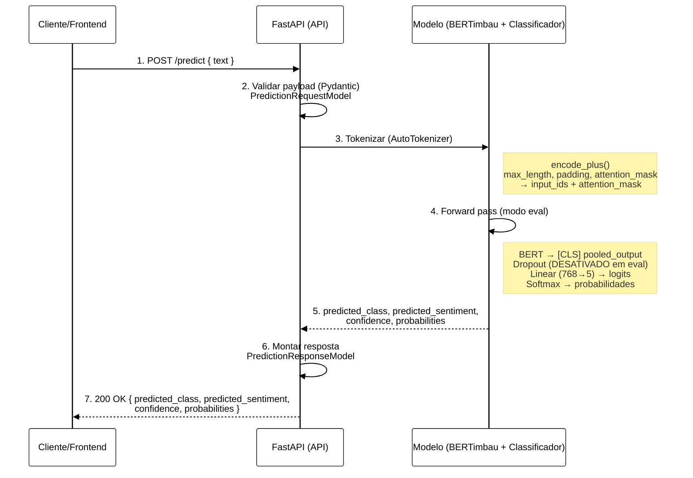

# 🐍 Sentiment Analysis API

## 👥 Autoria

**Autor:** Lucas Evandro Theisen  
**Orientador:** Prof. Dr. Anderson Brilhador  
**Coorientador:** Prof. Dr. Giuvane Conti

**Instituição:** Universidade Tecnológica Federal do Paraná - Campus Santa Helena  
**Curso:** Bacharelado em Ciência da Computação  
**Ano:** 2025

### Banca Examinadora

- Prof. Dr. Anderson Brilhador (Orientador) - UTFPR
- Profa. Dra. Giani Carla Ito - UTFPR
- Profa. Dra. Leliane Rezende - UTFPR

**Data de Aprovação:** 1 de dezembro de 2025

---

## 📄 Licença

<div align="center">


**Creative Commons Atribuição-NãoComercial-CompartilhaIgual 4.0 Internacional**

</div>

© 2025 Lucas Evandro Theisen

Esta licença permite que reutilizadores distribuam, remixem, adaptem e criem a partir do material em qualquer meio ou formato apenas para fins não comerciais. Se outros modificarem ou adaptarem o material, eles devem licenciar o material modificado sob termos idênticos.

### 📋 Termos da Licença

**BY:** O crédito deve ser dado a você, o criador.

**NC:** Apenas o uso não comercial do seu trabalho é permitido. *Não comercial significa não primariamente direcionado para ou dirigido para vantagem comercial ou compensação monetária.*

**SA:** Adaptações devem ser compartilhadas sob os mesmos termos.

---

Veja o arquivo [LICENSE](../../LICENSE) para o texto legal completo da licença.

---

API REST desenvolvida em FastAPI para análise de sentimentos utilizando modelo BERT (BERTimbau) fine-tuned para português brasileiro.

---

## 📋 Índice

- [Visão Geral](#-visão-geral)
- [Arquitetura do Modelo](#-arquitetura-do-modelo)
- [Instalação](#-instalação)
- [Uso](#-uso)
- [Endpoints da API](#-endpoints-da-api)
- [Configuração](#-configuração)
- [Estrutura do Projeto](#-estrutura-do-projeto)
- [Desenvolvimento](#-desenvolvimento)
- [Deploy com Docker](#-deploy-com-docker)

---

## 🎯 Visão Geral

Esta API fornece um endpoint de predição de sentimentos que classifica textos em português em **5 níveis**:

1. **Extremamente Negativo** (classe 0)
2. **Negativo** (classe 1)
3. **Neutro** (classe 2)
4. **Positivo** (classe 3)
5. **Extremamente Positivo** (classe 4)

### ✨ Características Principais

- ⚡ **Alta Performance**: FastAPI com suporte assíncrono
- 🧠 **Modelo Avançado**: BERTimbau (BERT para português)
- 📊 **Probabilidades Detalhadas**: Retorna confiança para todas as classes
- 🔒 **Validação Automática**: Schemas Pydantic para request/response
- 📚 **Documentação Interativa**: Swagger UI e ReDoc
- 🌐 **CORS Habilitado**: Pronto para integração com frontends
- 🐳 **Docker Ready**: Containerização completa

### 🚀 Performance

- **Tempo de resposta**: < 500ms por requisição (CPU)
- **Throughput**: Capaz de processar múltiplas requisições concorrentes
- **GPU Support**: Detecção automática e uso de CUDA quando disponível

---

## 🏗️ Arquitetura do Modelo

### Fluxo de Inferência



### Componentes do Modelo

#### 1. **BERTimbau** (`neuralmind/bert-base-portuguese-cased`)

- Modelo BERT pré-treinado especificamente para português brasileiro
- 12 camadas de transformer
- Hidden size: 768
- Vocabulário: 29,794 tokens

#### 2. **Arquitetura do Classificador**

```python
SentimentClassifier(
    bert: BERTimbau (pré-treinado, congelado)
    dropout: Dropout(p=0.3)
    linear: Linear(in_features=768, out_features=5)
)
```

#### 3. **Parâmetros de Configuração**

| Parâmetro | Valor | Descrição |
|-----------|-------|-----------|
| `MAX_SEQUENCE_LEN` | Definido no treinamento | Comprimento máximo de entrada (tokenização) |
| `DROPOUT` | 0.3 | Taxa de dropout para regularização |
| `HIDDEN_SIZE` | Definido pelo modelo BERT | Dimensão dos embeddings (768 para bert-base) |
| `NUM_CLASSES` | 5 | Quantidade de classes de sentimento |

---

## 📦 Instalação

### Pré-requisitos

- Python 3.9 ou superior
- pip ou conda
- (Opcional) CUDA para uso de GPU

### Instalação Local

```bash
# Clone o repositório (se ainda não tiver)
cd sentiment_analysis_project/api

# Crie um ambiente virtual
python -m venv venv

# Ative o ambiente virtual
# Windows
.\venv\Scripts\activate

# Linux/Mac
source venv/bin/activate

# Instale as dependências
pip install -r requirements.txt
```

### Dependências Principais

```plaintext
fastapi>=0.95          # Framework web
uvicorn                # Servidor ASGI
torch>=2.0             # PyTorch para inferência
transformers>=4.30     # Hugging Face Transformers (BERT)
pydantic>=1.10         # Validação de dados
numpy>=1.23            # Operações numéricas
```

---

## 🚀 Uso

### Iniciar o Servidor

#### Desenvolvimento (com hot reload)

```bash
cd sentiment_analysis_project/api

uvicorn sentiment_analyzer.api:app --reload --host 0.0.0.0 --port 8000
```

#### Produção

```bash
uvicorn sentiment_analyzer.api:app --host 0.0.0.0 --port 8000 --workers 4
```

### Acessar a Documentação

Após iniciar o servidor, acesse:

- **Swagger UI**: <http://localhost:8000/docs>
- **ReDoc**: <http://localhost:8000/redoc>

---

## 📡 Endpoints da API

### `POST /predict`

Classifica o sentimento de um texto.

#### Request

**Headers:**

```
Content-Type: application/json
```

**Body (JSON):**

```json
{
  "text": "Este produto é excelente! Recomendo muito!"
}
```

**Schema (Pydantic):**

```python
class PredictionRequestModel(BaseModel):
    text: str  # Texto para análise (mínimo 1 caractere)
```

#### Response

**Status Code:** `200 OK`

**Body (JSON):**

```json
{
  "predicted_class": 4,
  "predicted_sentiment": "extremamente positivo",
  "confidence": 0.9823,
  "probabilities": [
    {
      "sentiment": "extremamente negativo",
      "probability": 0.0012,
      "sentiment_class": 0
    },
    {
      "sentiment": "negativo",
      "probability": 0.0034,
      "sentiment_class": 1
    },
    {
      "sentiment": "neutro",
      "probability": 0.0098,
      "sentiment_class": 2
    },
    {
      "sentiment": "positivo",
      "probability": 0.0033,
      "sentiment_class": 3
    },
    {
      "sentiment": "extremamente positivo",
      "probability": 0.9823,
      "sentiment_class": 4
    }
  ]
}
```

**Schema (Pydantic):**

```python
class ClassProbabilityModel(BaseModel):
    sentiment: str          # Nome do sentimento
    probability: float      # Probabilidade [0-1]
    sentiment_class: int    # Índice da classe [0-4]

class PredictionResponseModel(BaseModel):
    predicted_class: int                      # Classe prevista [0-4]
    predicted_sentiment: str                  # Nome do sentimento
    confidence: float                         # Confiança [0-1]
    probabilities: List[ClassProbabilityModel]  # Todas as probabilidades
```

#### Exemplos de Uso

##### cURL

```bash
curl -X POST "http://localhost:8000/predict" \
  -H "Content-Type: application/json" \
  -d '{
    "text": "O atendimento foi péssimo e o produto chegou quebrado."
  }'
```

##### PowerShell

```powershell
$headers = @{
    "Content-Type" = "application/json"
}

$body = @{
    text = "O atendimento foi péssimo e o produto chegou quebrado."
} | ConvertTo-Json

Invoke-RestMethod -Uri "http://localhost:8000/predict" `
  -Method POST `
  -Headers $headers `
  -Body $body
```

##### Python (requests)

```python
import requests

url = "http://localhost:8000/predict"
payload = {
    "text": "O atendimento foi péssimo e o produto chegou quebrado."
}

response = requests.post(url, json=payload)
result = response.json()

print(f"Sentimento: {result['predicted_sentiment']}")
print(f"Confiança: {result['confidence']:.2%}")
```

##### JavaScript (fetch)

```javascript
const response = await fetch('http://localhost:8000/predict', {
  method: 'POST',
  headers: {
    'Content-Type': 'application/json'
  },
  body: JSON.stringify({
    text: 'O atendimento foi péssimo e o produto chegou quebrado.'
  })
});

const result = await response.json();
console.log('Sentimento:', result.predicted_sentiment);
console.log('Confiança:', result.confidence);
```

#### Códigos de Erro

| Status Code | Descrição |
|------------|-----------|
| `200` | Sucesso |
| `422` | Erro de validação (texto inválido) |
| `500` | Erro interno do servidor |

**Exemplo de Erro (422):**

```json
{
  "detail": [
    {
      "loc": ["body", "text"],
      "msg": "field required",
      "type": "value_error.missing"
    }
  ]
}
```

---

## ⚙️ Configuração

### Arquivo `config.json`

Localizado em `api/config.json`:

```json
{
    "BASE_MODEL": "neuralmind/bert-base-portuguese-cased",
    "PRE_TRAINED_MODEL": "assets/best_model_state.bin",
    "CLASS_NAMES": [
        "extremamente negativo",
        "negativo",
        "neutro",
        "positivo",
        "extremamente positivo"
    ],
    "MAX_SEQUENCE_LEN": 281
}
```

### Parâmetros Configuráveis

| Parâmetro | Descrição | Padrão |
|-----------|-----------|--------|
| `BASE_MODEL` | Nome do modelo BERT no Hugging Face | `neuralmind/bert-base-portuguese-cased` |
| `PRE_TRAINED_MODEL` | Caminho para os pesos do modelo treinado | `assets/best_model_state.bin` |
| `CLASS_NAMES` | Lista de nomes das classes | 5 classes de sentimento |
| `MAX_SEQUENCE_LEN` | Comprimento máximo da sequência | 281 tokens |

### Modelo Treinado

O arquivo de pesos do modelo (`best_model_state.bin`) deve estar localizado em:

```
api/
└── assets/
    └── best_model_state.bin
```

**Características do Modelo:**

- Formato: PyTorch state_dict (`.bin`)
- Tamanho: ~420 MB
- Treinado em: Dataset de reviews em português
- Métricas de performance: (adicione suas métricas aqui)

---

## 📂 Estrutura do Projeto

```
api/
├── 📄 Dockerfile                          # Imagem Docker da API
├── 📄 requirements.txt                    # Dependências Python
├── 📄 config.json                         # Configurações do modelo
├── 📄 README.md                           # Esta documentação
│
├── 📂 assets/                             # Recursos estáticos
│   └── 📄 best_model_state.bin            # Modelo treinado (PyTorch)
│
├── 📂 bin/                                # Scripts auxiliares
│   └── 📄 start_server.sh                 # Script de inicialização
│
└── 📂 sentiment_analyzer/                 # Código fonte principal
    ├── 📄 __init__.py
    ├── 📄 api.py                          # Definição da API FastAPI
    │
    ├── 📂 classifier/                     # Componentes do modelo
    │   ├── 📄 __init__.py
    │   ├── 📄 model.py                    # Carregamento e inferência
    │   └── 📄 sentiment_classifier.py     # Arquitetura do classificador
    │
    └── 📂 models/                         # Schemas Pydantic
        ├── 📄 __init__.py
        ├── 📄 prediction_request_model.py     # Schema de entrada
        ├── 📄 prediction_response_model.py    # Schema de saída
        └── 📄 class_probability_model.py      # Schema de probabilidade
```

### Descrição dos Arquivos

#### `api.py`

Arquivo principal que define a aplicação FastAPI:

- Configuração de CORS
- Definição do endpoint `/predict`
- Injeção de dependência do modelo

#### `classifier/model.py`

Classe `Model` responsável por:

- Carregar o tokenizer BERTimbau
- Carregar o modelo treinado
- Realizar inferência (método `predict`)
- Singleton pattern para otimização

#### `classifier/sentiment_classifier.py`

Classe `SentimentClassifier` (PyTorch `nn.Module`):

- Define a arquitetura: BERT + Dropout + Linear
- Método `forward` para propagação

#### `models/*.py`

Schemas Pydantic para validação:

- `PredictionRequestModel`: Validação de entrada
- `PredictionResponseModel`: Estrutura de resposta
- `ClassProbabilityModel`: Probabilidade individual

---

## 💻 Desenvolvimento

### Setup do Ambiente de Desenvolvimento

```bash
# Clone e entre no diretório
cd sentiment_analysis_project/api

# Crie ambiente virtual
python -m venv venv
source venv/bin/activate  # Linux/Mac
# ou
.\venv\Scripts\activate   # Windows

# Instale dependências
pip install -r requirements.txt

# Instale dependências de desenvolvimento (opcional)
pip install pytest pytest-cov black flake8 mypy
```

### Executar em Modo de Desenvolvimento

```bash
# Com hot reload
uvicorn sentiment_analyzer.api:app --reload --host 0.0.0.0 --port 8000

# Com debug logs
uvicorn sentiment_analyzer.api:app --reload --log-level debug
```

### Testes

```bash
# Executar testes (se implementados)
pytest

# Com cobertura
pytest --cov=sentiment_analyzer

# Apenas testes de integração da API
pytest tests/test_api.py -v
```

### Linting e Formatação

```bash
# Formatar código com Black
black sentiment_analyzer/

# Verificar estilo com Flake8
flake8 sentiment_analyzer/

# Type checking com MyPy
mypy sentiment_analyzer/
```

### Adicionar Novos Endpoints

1. Defina o schema Pydantic em `models/`
2. Adicione o endpoint em `api.py`:

```python
@app.post("/seu_endpoint", response_model=SeuResponseModel)
def seu_endpoint(request: SeuRequestModel):
    # Implementação
    return SeuResponseModel(...)
```

### Atualizar o Modelo

Para substituir o modelo treinado:

1. Treine seu novo modelo
2. Salve os pesos com `torch.save(model.state_dict(), 'novo_modelo.bin')`
3. Substitua `assets/best_model_state.bin`
4. Reinicie o servidor

---

## 🐳 Deploy com Docker

### Build da Imagem

```bash
cd sentiment_analysis_project/api

# Build
docker build -t sentiment-api:latest .

# Verificar imagem criada
docker images | grep sentiment-api
```

### Executar Container

```bash
# Modo padrão
docker run -d \
  --name sentiment-api \
  -p 8000:8000 \
  sentiment-api:latest

# Com GPU (NVIDIA Docker)
docker run -d \
  --name sentiment-api \
  --gpus all \
  -p 8000:8000 \
  sentiment-api:latest

# Ver logs
docker logs -f sentiment-api

# Parar container
docker stop sentiment-api

# Remover container
docker rm sentiment-api
```

### Dockerfile Explicado

```dockerfile
FROM python:3.9-slim

WORKDIR /app

# Copiar requirements e instalar dependências
COPY requirements.txt .
RUN pip install --no-cache-dir -r requirements.txt

# Copiar código fonte e assets
COPY . .

# Expor porta
EXPOSE 8000

# Comando de inicialização
CMD ["uvicorn", "sentiment_analyzer.api:app", "--host", "0.0.0.0", "--port", "8000"]
```

### Docker Compose

A API já está configurada no `docker-compose.yml` principal:

```yaml
api_service:
  build: ./api/.
  container_name: container_sentiment_analysis_api
  ports:
    - "8000:8000"
```

Para executar:

```bash
cd sentiment_analysis_project
docker-compose up -d api_service
```

---

## 📚 Documentação Adicional

### Documentos do Projeto

| Documento | Descrição |
|-----------|-----------|
| [README.txt](../../../README.txt) | Instruções de uso do sistema completo |
| [README.md](../../../README.md) | Visão geral do projeto |
| [notebooks_and_scripts/README.md](../../../notebooks_and_scripts/README.md) | Pipeline de dados e treinamento |
| [sentiment_analysis_project/README.md](../README.md) | Documentação técnica do sistema (deploy com Docker Compose - API e frontend Flutter web) |
| [sentiment_analysis_project/api/README.md (este arquivo)](README.md) | Documentação técnica da API |
| [sentiment_analysis_project/web/README.md](../web/README.md) | Documentação do frontend Flutter web |
| [sentiment_analysis_app/README.md](../../../sentiment_analysis_app/README.md) | Documentação da aplicação front-end Flutter |
| [LICENSE](../../../LICENSE) | Licença do projeto |

---

## 📄 Citação Acadêmica

Se você utilizar este trabalho em sua pesquisa, por favor cite:

```bibtex
@mastersthesis{theisen2025sentiment,
  title={Análise de Sentimentos em Comentários de Aplicativos Comerciais},
  author={Theisen, Lucas Evandro},
  year={2025},
  school={Universidade Tecnológica Federal do Paraná},
  type={Trabalho de Conclusão de Curso},
  address={Santa Helena, PR, Brasil}
}
```

**Nota:** Esta documentação faz parte do TCC "ANÁLISE DE SENTIMENTOS EM COMENTÁRIOS DE APLICATIVOS COMERCIAIS", desenvolvido na UTFPR - Campus Santa Helena em 2025.
