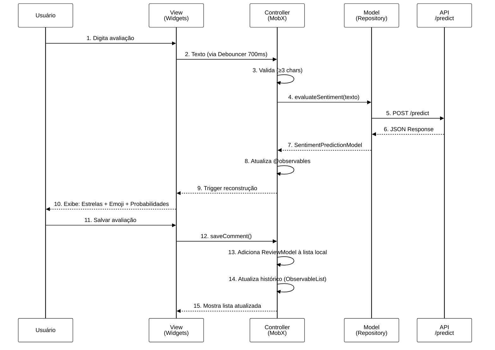

# 💻 Sentiment Analysis Web Frontend

## 👥 Autoria

**Autor:** Lucas Evandro Theisen  
**Orientador:** Prof. Dr. Anderson Brilhador  
**Coorientador:** Prof. Dr. Giuvane Conti

**Instituição:** Universidade Tecnológica Federal do Paraná - Campus Santa Helena  
**Curso:** Bacharelado em Ciência da Computação  
**Ano:** 2025

### Banca Examinadora

- Prof. Dr. Anderson Brilhador (Orientador) - UTFPR
- Profa. Dra. Giani Carla Ito - UTFPR
- Profa. Dra. Leliane Rezende - UTFPR

**Data de Aprovação:** 1 de dezembro de 2025

**Assunto:** Trabalho de Conclusão de Curso (Bacharelado em Ciência da Computação)

**Palavras-chave:** análise de sentimentos, processamento de linguagem natural, transformers, BERT, aprendizado profundo

---

## 📄 Licença

<div align="center">


**Creative Commons Atribuição-NãoComercial-CompartilhaIgual 4.0 Internacional**

</div>

© 2025 Lucas Evandro Theisen

Esta licença permite que reutilizadores distribuam, remixem, adaptem e criem a partir do material em qualquer meio ou formato apenas para fins não comerciais. Se outros modificarem ou adaptarem o material, eles devem licenciar o material modificado sob termos idênticos.

### 📋 Termos da Licença

**BY:** O crédito deve ser dado a você, o criador.

**NC:** Apenas o uso não comercial do seu trabalho é permitido. *Não comercial significa não primariamente direcionado para ou dirigido para vantagem comercial ou compensação monetária.*

**SA:** Adaptações devem ser compartilhadas sob os mesmos termos.

---

Veja o arquivo [LICENSE](../../LICENSE) para o texto legal completo da licença.

---

---

Interface web responsiva desenvolvida em Flutter para análise de sentimentos em tempo real.

---

## 📋 Índice

- [Visão Geral](#-visão-geral)
- [Características](#-características)
- [Arquitetura](#-arquitetura)
- [Tecnologias](#-tecnologias)
- [Estrutura do Projeto](#-estrutura-do-projeto)
- [Deploy com Docker](#-deploy-com-docker)
- [Desenvolvimento](#-desenvolvimento)
- [Build e Deploy](#-build-e-deploy)

---

## 🎯 Visão Geral

Interface web moderna e intuitiva que permite aos usuários analisarem sentimentos de textos em português, visualizando resultados em tempo real com animações e indicadores visuais de confiança.

### ✨ Características Principais

- 🎨 **Interface Moderna**: Design limpo e responsivo
- ⚡ **Análise em Tempo Real**: Debouncing para otimizar requisições
- 📊 **Visualização de Probabilidades**: Indicadores visuais de confiança por classe
- 😊 **Animações Expressivas**: Emojis animados com Lottie para cada sentimento
- 📱 **Responsivo**: Adaptável a diferentes tamanhos de tela
- 🔄 **Feedback Instantâneo**: Toast notifications para sucesso/erro
- 🌐 **CORS Ready**: Integração direta com a API REST

### 🎭 Classes de Sentimento

1. **Extremamente Negativo** (😢 - bigFrown)
2. **Negativo** (☹️ - frown)
3. **Neutro** (😐 - neutralFace)
4. **Positivo** (😊 - slightlyHappy)
5. **Extremamente Positivo** (😄 - smileWithBigEyes)

---

## 🏗️ Arquitetura

### Stack de Tecnologias

```
Flutter Web → Nginx → Docker Container
```

### Fluxo de Interação



---

## 🛠️ Tecnologias

| Tecnologia | Versão | Uso |
|-----------|--------|-----|
| **Flutter** | Latest | Framework de desenvolvimento |
| **Dart** | Latest | Linguagem de programação |
| **Nginx** | Alpine | Servidor web para arquivos estáticos |
| **Docker** | Latest | Containerização |
| **Lottie** | - | Animações de emojis |
| **HTTP Package** | - | Requisições à API |

### Dependências Principais

- `animated_emoji`: Animações Lottie de emojis
- `fluttertoast`: Notificações toast
- `http`: Cliente HTTP para comunicação com API

---

## 📁 Estrutura do Projeto

```
web/
├── assets/                      # Assets do Flutter
│   ├── packages/
│   │   └── animated_emoji/
│   │       └── lottie/         # Animações JSON dos emojis
│   │           ├── bigFrown.json
│   │           ├── frown.json
│   │           ├── neutralFace.json
│   │           ├── slightlyHappy.json
│   │           └── smileWithBigEyes.json
│   ├── fonts/                  # Fontes personalizadas
│   └── shaders/                # Shaders do Flutter
├── canvaskit/                  # Engine de renderização WebGL
├── nginx/                      # Configuração do Nginx
│   └── default.conf           # Configuração do servidor
├── Dockerfile                  # Configuração do container
├── index.html                  # Página principal HTML
├── main.dart.js               # Código Dart compilado para JS
├── flutter_service_worker.js  # Service Worker para PWA
├── manifest.json              # Manifesto da aplicação web
└── README.md                  # Este arquivo
```

---

## 🐳 Deploy com Docker

### Usando Docker Compose (Recomendado)

O projeto está configurado para rodar em um container Docker com Nginx. Execute a partir do diretório raiz do projeto:

```bash
# A partir do diretório sentiment_analysis_project/sentiment_analysis_project/
docker-compose up -d
```

O serviço web estará disponível em:

- **URL**: <http://localhost:8080>
- **Depende**: `api_service` (backend)

### Dockerfile

```dockerfile
# Usa imagem base do nginx
FROM nginx:alpine

# Copia os arquivos gerados pelo Flutter Web para a pasta do Nginx
COPY . /usr/share/nginx/html

# Substitui a configuração padrão do Nginx
COPY ./nginx/default.conf /etc/nginx/conf.d/default.conf
```

### Configuração do Nginx

O arquivo `nginx/default.conf` está configurado para:

- Servir arquivos estáticos do Flutter
- Suportar roteamento SPA (Single Page Application)
- Cache otimizado para assets
- Fallback para `index.html` em rotas não encontradas

---

## 🔧 Desenvolvimento

### Pré-requisitos

- Flutter SDK instalado
- Chrome ou outro navegador compatível

### Executar Localmente (Modo Desenvolvimento)

```bash
# No diretório do projeto Flutter original (não no diretório web/)
flutter run -d chrome
```

### Hot Reload

Durante o desenvolvimento, o Flutter oferece hot reload automático ao salvar alterações nos arquivos `.dart`.

### Debug

```bash
flutter run -d chrome --debug
```

---

## 🚀 Build e Deploy

### Gerar Build de Produção

```bash
# No diretório do projeto Flutter
flutter build web --release

# Os arquivos serão gerados em build/web/
```

### Copiar Build para o Diretório Web

Após gerar a build, copie os arquivos gerados para o diretório `web/`:

```bash
# Exemplo (ajuste os caminhos conforme necessário)
cp -r build/web/* ../sentiment_analysis_project/web/
```

### Atualizar Container Docker

```bash
# Rebuild e restart do container
docker-compose up -d --build web_service
```

---

## 📡 Integração com API

A aplicação web se comunica com o backend através da API REST:

### Endpoint Utilizado

```
POST http://localhost:8000/predict
Content-Type: application/json

{
  "text": "Texto para análise"
}
```

### Resposta Esperada

```json
{
  "predicted_class": 4,
  "predicted_sentiment": "Extremamente Positivo",
  "confidence": 0.9234,
  "probabilities": {
    "Extremamente Negativo": 0.0123,
    "Negativo": 0.0234,
    "Neutro": 0.0234,
    "Positivo": 0.0175,
    "Extremamente Positivo": 0.9234
  }
}
```

---

## 🎨 Personalização

### Alterar URL da API

Para apontar para um backend diferente, edite a URL base no código Dart:

```dart
// No arquivo principal do Flutter
const String API_BASE_URL = 'http://localhost:8000';
```

### Customizar Nginx

Edite `nginx/default.conf` para ajustar:

- Portas
- Cache policies
- Redirecionamentos
- Headers de segurança

---

## 📝 Notas Importantes

- Os arquivos em `web/` são **arquivos compilados** do Flutter, não o código-fonte
- Para modificar a aplicação, edite o código Dart original e gere nova build
- O Nginx está configurado para servir uma SPA (Single Page Application)
- O container depende do `api_service` estar rodando para funcionalidade completa

---

## 📚 Documentação Adicional

### Documentos do Projeto

| Documento | Descrição |
|-----------|-----------|
| [README.txt](https://github.com/LucasTheisen31/sentiment_analysis_project/blob/main/README.txt) | Instruções de uso do sistema completo |
| [README.md](https://github.com/LucasTheisen31/sentiment_analysis_project/blob/main/README.md) | Visão geral do projeto |
| [notebooks_and_scripts/README.md](https://github.com/LucasTheisen31/sentiment_analysis_project/blob/main/notebooks_and_scripts/README.md) | Pipeline de dados e treinamento |
| [sentiment_analysis_project/README.md](https://github.com/LucasTheisen31/sentiment_analysis_project/blob/main/sentiment_analysis_project/README.md) | Documentação técnica do sistema (deploy com Docker Compose - API e frontend Flutter web) |
| [sentiment_analysis_project/api/README.md](https://github.com/LucasTheisen31/sentiment_analysis_project/blob/main/sentiment_analysis_project/api/README.md) | Documentação técnica da API |
| [sentiment_analysis_project/web/README.md](https://github.com/LucasTheisen31/sentiment_analysis_project/blob/main/sentiment_analysis_project/web/README.md) | Documentação do frontend Flutter web (este arquivo) |
| [sentiment_analysis_app/README.md](https://github.com/LucasTheisen31/sentiment_analysis_project/blob/main/sentiment_analysis_app/README.md) | Documentação da aplicação front-end Flutter |
| [LICENSE](https://github.com/LucasTheisen31/sentiment_analysis_project/blob/main/LICENSE) | Licença do projeto |

---

## 📄 Citação Acadêmica

Se você utilizar este trabalho em sua pesquisa, por favor cite:

```bibtex
@mastersthesis{theisen2025sentiment,
  title={Análise de Sentimentos em Comentários de Aplicativos Comerciais},
  author={Theisen, Lucas Evandro},
  year={2025},
  school={Universidade Tecnológica Federal do Paraná},
  type={Trabalho de Conclusão de Curso},
  address={Santa Helena, PR, Brasil}
}
```

**Nota:** Esta documentação faz parte do TCC "ANÁLISE DE SENTIMENTOS EM COMENTÁRIOS DE APLICATIVOS COMERCIAIS", desenvolvido na UTFPR - Campus Santa Helena em 2025.
